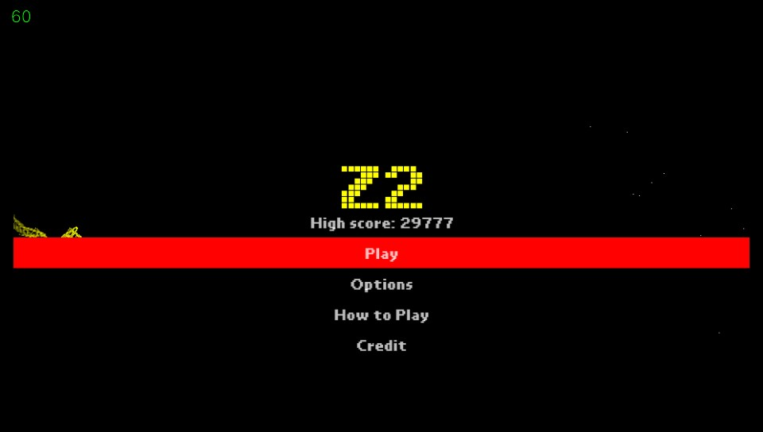

# Z2
A game inspired by Geometry Dash Wave gamemode.
This game made in **2 days**. 

**Used:**
- GameMaker Studio 1.4.9999 by Yoyo Games
- [GayMaker 1.7.7 by LiEnby](https://github.com/LiEnby/GayMaker)
- [freesound.org](https://freesound.org/) [pixabay.com](https://pixabay.com/ja/) for sound effects
- music credits are in game...

**Todo list:**

 - [ ] fix Yandere ahh code
 - [ ] add ability to submit score to internet
 - [ ] add more enemies 
 - [x] make it more playable (done, i think)
 - [ ] remove Herobrine

---

## Changelog

**V1.1.0**

- Make game more playable (By decreasing its difficulty)
- Added SFX for select and game start
- Made some adjustment here and there

**V1.0.1**

- initial release
- where tf is 1.0.0?????